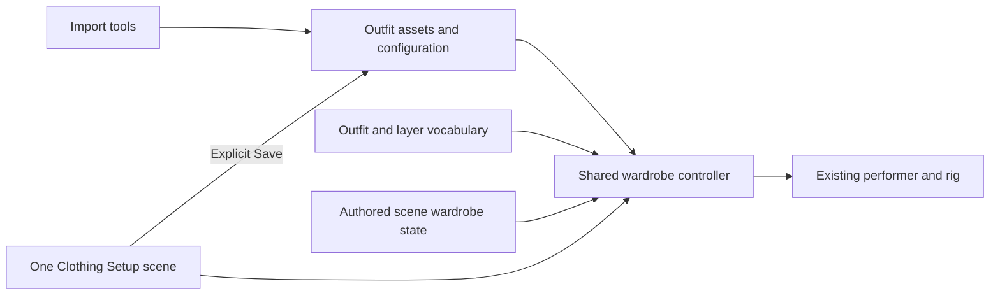

# Runtime wardrobe, scene recall and clothing setup specification

Date: 2026-10-04. Status: implementation specification; runtime work is not yet
implemented. The user requested this specification after approving the maid's
functional result and repairing the shared import path. Independent clean-context
import acceptance remains a separate, unpassed gate.

For implementation, begin at [wardrobe-execution/START.md](wardrobe-execution/START.md).
That package fixes execution choices, names code seams and separates the work into
validated, resumable stages. Its CONTRACT is the implementation-specific companion
to this product specification. Runtime and new validation runners remain pending.

## 1. Product contract

There is one wardrobe system, consumed by gameplay commands, authored scene
initialization, and a persistent clothing setup scene. Importing an outfit creates
data/assets and registers a review candidate. It does not create a production
Unity scene for that outfit. Scene authors choose a named wardrobe preset; the
runtime applies all of that preset's clothing, coverage, fitting and footwear
effects to the existing performer. Artists use the setup scene to maintain those
same assets over time.

Terminology matters:

| Term | Meaning |
| --- | --- |
| Imported package | One DUF/FBX conversion with meshes, surface materials, source evidence and generated fitting data. |
| Item | An identifiable garment, hair, footwear pair or accessory, potentially composed of several dependent meshes/shells. |
| Outfit/preset | A named, saved selection of mesh pieces assigned to Base/1/2, configuration variants and validated fit states. This is what `Outfit(...)` recalls. |
| Authored scene | A named performance/environment setup that includes a wardrobe selection for each performer. It is not an outfit mesh or a generated import review scene. |
| Setup scene | One persistent Unity scene used to review and configure the catalog. |
| Import test host | A disposable isolated scene used by automated import checks; it is not a gameplay dependency. |

User decisions: shoes belong to outfits; a separate gameplay shoe-selection verb
is not required. Every outfit has at most three ordered layers: base, 1 and 2.
All clothing/shoe mesh pieces initially belong to base; the artist assigns pieces
to 1 or 2. Loading an outfit displays every populated layer. Remove the highest
populated visible layer; add the lowest populated hidden layer. Removing the last
visible layer reaches naked. Keep current hair unless the outfit specifies hair.
The scene-binding contract below records outfit/layer state for named authored
content; it does not introduce a separate general named-scene playback system.



## 2. Existing code and required changes

These are inspected project facts, not proposed new APIs:

- `SuccubusPerformer` is the existing C# authoring facade. It exposes `Pose`,
  `PoseAsync`, `WalkToAsync`, `DissolveOutAsync`, `DissolveInAsync`, etc. The earlier
  vocabulary direction used tentative `ChangeOutfit`; this spec settles on
  `Outfit`/`OutfitAsync`, matching the user's semantic request. No textual DSL
  parser is required to implement this capability.
- `Assets/FirstPerformanceVoid/FirstContactPerformance.cs` is a specific authored
  C# performance with `Run`/`RunSequence`; it is not a general named-scene catalog.
  Wardrobe initialization integrates at that authoring seam without replacing
  the accepted sequence with a new director framework.
- `WardrobeOutfitDefinition` currently contains an imported inventory, canonical
  body reference, `reviewBody` and footwear profile. It has no equip operation.
- `LaraWardrobe` follows body morphs, copies dissolve properties, controls two
  body-coverage channels and manages attachment bounds. It currently treats all
  inventory pieces, including hair, as clothes and rejects an empty inventory.
- `LaraHeelReview` provides flat-floor support and reads seating ownership. Some
  of its settings are scene fields, its setters mutate the shared profile, and
  its floor offset comes from a specific import host. It is not the production
  ownership/persistence contract.
- `LaraAnatomyControls.Configure` resets anatomy values; mesh replacement must
  use a preserving rebind instead. Facial, speech and breathing systems also need
  their mesh-index caches verified against a replacement mesh.
- Dissolve uses the existing body renderer and a particle body/profile with mesh
  bindings. Changing body geometry requires a tested runtime rebind.
- Existing imported clothing can contain a baked shoe-pose deformation. A shoe
  profile swap alone does not guarantee that stockings or other foot-bound
  garments fit another heel pose.
- The existing Imported Outfits window opens per-import review scenes. It becomes
  a catalog entry point into Clothing Setup; historical snapshots remain optional.

## 3. Asset ownership and identities

Keep generated import data, artist configuration and performer state distinct:

| Owner | Persistent data | Who may write it |
| --- | --- | --- |
| Import recipe/package | Source hashes, source owner/surface IDs, topology/rig signature, generated meshes, source material baselines, calibrated deformation and local-bone data | Import tools |
| Item configuration | Display name, slot/role, material variant references, dependencies, coverage policy, footwear tuning and approved fit support | Explicit editor Save; mechanical import refresh only for generated fields |
| `WardrobePreset` | Stable ID, display name/aliases, mesh/item selections with layer 0/1/2, variant selections, hair policy, included footwear, fit states and optional walk selection | Artist/editor authoring |
| `WardrobeCatalog` | Build-visible preset/item references, stable keys and review/release status | Catalog publisher/editor tools |
| `WardrobeFitSet` | Generated compatible body and attachment variants, coverage masks, toe references/bind data, particle bindings and source revision dependencies for a resolved item combination | Fit compiler/import tools |
| Performer instance | Current resolved wardrobe, body morph values, animation/visibility state, temporary overrides and instance materials/blocks | Runtime only |
| Setup preview session | Unsaved edits, isolated-piece toggles, camera, pose/morph probes, draft selection | Setup UI; explicitly saved portions go to assets |

Initially retain `WardrobeOutfitDefinition` as the imported-package adapter, with
its GUID preserved. Add authored `WardrobePreset` assets instead of letting the
importer overwrite artist composition. `reviewBody` becomes a migration input for
the generated fit set; gameplay cannot depend on loading its review scene.

An item reference uses a stable package asset reference plus source piece IDs,
not renderer display names or instance IDs. Group a garment and its shells as
one selectable item with dependent render parts. A combined shoe pair is one
footwear item. Hair with several meshes/bones is one hair item. An apron may be
its own overlay item or a dependent item according to the authored configuration.
This grouping is recorded once during review; imports retain it by source ID.

Public keys are stable lowercase ASCII identifiers such as `maid`,
`schoolgirl`, `maid-pumps`, `emiko`. Display names are freely editable. Resolve
exact IDs or declared aliases after trimming and case normalization; reject
collisions and ambiguous names. Never select a fuzzy match silently. Existing
`first-outfit`, `second-outfit`, `third-outfit` remain source IDs and aliases;
friendly names are authored metadata. Built-in `unclothed` means no garments or
shoes, with the stated hair/accessory policy. `barefoot` is the reported footwear
state when no footwear layer is visible, not a separate required gameplay verb.

The catalog is a serialized asset with direct Unity references, generated in the
editor. Runtime resolves an in-memory dictionary; it does not use AssetDatabase,
scan the filesystem, read DUFs or require the original FBXs. Package references
must bring every required mesh/material/fit/particle asset into a player build.
Start with direct references and lazy instance creation; Addressables are not a
dependency for this milestone.

Minimum serialized authoring contract (all new schemas start at version 1):

| Asset | Required fields |
| --- | --- |
| `WardrobePreset` | schemaVersion, stable id, displayName, aliases, characterSignature, configurationRevision, parts[{packageRef, sourcePieceId, layer:0..2}], material/configuration variant refs, hairMode, optional hairRef, optional includedFootwearRef, compiledStateRefs |
| `WardrobeFitState` | configuration/source hashes, visibleLayerMask, compatible canonical signature, body mesh/bind reference, attachment mesh/bind overrides by stable piece ID, compiled coverage, active footwear or barefoot, particle binding data, technical report reference |
| `WardrobeCatalog` | stable ID/alias index, draft preset revision refs, released preset revision refs, validation/visual-review revision records |
| `SceneWardrobeSnapshot` | schemaVersion, bindings[{performerBindingId, presetId or unclothed, configurationVariantId, layerCeiling:-1..2, resolvedHairId/default, retainedAppearanceRefs}] |

Use typed asset references for packaged resources and stable IDs for scene-facing
identity. Validate unique source-piece membership, one layer per piece, ceiling
range, alias uniqueness and character signature before building a runtime catalog.
Compiled states are keyed by effective visible mask, so empty layers do not
duplicate body/attachment assets. Catalog approval state is separate from the
import recipe; imports cannot mark human approval automatically. Measure catalog,
mesh and material memory in the twelve-configuration test; direct references do
not promise asset streaming.

## 4. Three layers, dressing state and footwear

Layer 0 is displayed as **Base**, layer 1 is above base, layer 2 is highest. Each
outfit mesh belongs to exactly one layer. All newly created/reimport-added clothing
and shoe meshes default to base. Existing assignments survive reimport by stable
source piece ID. The system never guesses layering from names, opacity or body
location. The artist decides which mesh pieces go in which layer.

In Setup, each clothing mesh row has Layer 1 and Layer 2 checkboxes. Both unchecked
means Base; checking either clears the other. Show the effective layer label next
to the mesh and support multi-select assignment. Layer membership is saved outfit
configuration, not a preview visibility flag. A piece cannot be split between
layers without an explicit source/mesh split. Hair classified as the persistent
hairstyle is outside undressing layers. An intentional removable wig/accessory
can instead be authored as an outfit piece. An outfit's explicit hairstyle remains
after undressing; outfit removal does not silently remove the current hair.

Related shells may have their own artist assignment where their dependency allows
it. If a shell requires its owner, it cannot remain visible in a state where that
owner is absent: validate the assignment and explain the affected meshes rather
than silently moving them. All meshes forming one functional footwear pair must
enter/leave together in one layer; show this constraint and offer a group assignment.

Store a selected preset and a layer ceiling (-1, 0, 1 or 2). PopulatedMask is the
three-bit mask of layers containing authored mesh pieces. VisibleMask is populated
layers at or below the ceiling. This permits only an ordered stack of populated
layers; empty layers are skipped. Loading uses ceiling 2. FullyDressed and CanAdd
are determined by visible versus populated masks, so empty upper layers never
produce a phantom add operation. Preview isolation and shader opacity do not alter populatedness.

| Operation | Result |
| --- | --- |
| `Outfit(id)` | Select preset, replace previous outfit pieces, show all populated layers, apply hair policy and active footwear. Calling it again while partly undressed redresses fully. |
| `TryRemoveLayer()` | Hide the highest populated visible layer and set the ceiling to the next lower populated visible layer, or -1 if none remains. |
| `TryAddLayer()` | Reveal the lowest populated hidden layer and raise the ceiling to it. |
| Remove while naked | Benign `NoChange(AlreadyNaked)`; no height/effect/selection changes. |
| Add while fully dressed | Benign `NoChange(FullyDressed)`. |
| Add without a selected/remembered outfit | Benign `NoChange(NoOutfitSelected)`. |
| Load a different outfit | Replace remembered preset and reset to all its populated layers. |
| Explicit `Outfit("unclothed")` | Naked with no selected/remembered clothing preset. Hair follows the explicit unclothed preset policy, default Keep. |

At ceiling -1, the selected outfit remains remembered for re-dressing even though
no outfit pieces are rendered. `IsNaked` means no visible outfit layers; persistent
hair/accessories do not change it. Loading an actual outfit requires at least one
clothing/shoe mesh; an empty import is not an outfit. A hair-only choice belongs
to appearance configuration.

Example: Base=panties+shoes, 1=dress, 2=apron. Remove gives dress+base, then base,
then naked once no visible piece still requires the bent-foot pose. If stockings
remain in Base after shoes are removed, preserve the bent pose and disable shoe
floor contact; the result may look awkward and the author is responsible for
removing hosiery and shoes together when desired. Add restores base (including shoe support), then
dress, then apron. With empty layer 1, remove/add goes directly between layer 2
and base. If base is empty and only layer 2 has clothing, removing it goes directly
to naked and adding restores layer 2. Every valid configuration has this round trip.

Shoes are included in an outfit and follow their assigned layer. The runtime does
not require a separate Footwear command or free shoe mixing for this milestone.
Twelve different shoe pairs are twelve reusable footwear configurations referenced
by outfits, without twelve rigs or scenes. For each new pair, import measures
pose/contact/lift; the artist reviews and tunes fit/height/walk once in Setup.

Compile at most four distinct visible states for an outfit (all, through 1,
base, naked), skipping duplicates from empty layers. Each state has correct
coverage, body/garment fit, footwear bindings and effect geometry. A shoe in an
outer layer can disappear while stockings in Base remain: the bent-foot pose stays
active until every visible pose-dependent piece is hidden, and shoe-floor contact
turns off as soon as shoes are hidden. Do not require a barefoot stocking conversion
or reject import/setup for this state. If the outfit has a footwear profile, keep
its reviewed lift/shrink while the bent pose remains active. Without a profile,
preserve the baked body pose with zero shoe lift/shrink/support; this may look
awkward and remains an authoring choice.

The fit compiler identifies the supported source pose and character signature,
reuses unaffected geometry, compiles reachable layer states, unions active opaque-
piece coverage, and stores dependency hashes plus validation evidence. A technical
fit problem unrelated to this accepted shoes/hosiery state may still produce Needs
Fit with its exact meshes/state and necessary Daz action. Runtime commands on a
valid released outfit do not require the author to know which layer contains shoes
or which body variant is needed.

Coverage belongs to source mesh pieces on canonical body vertices; compile the
union for each reachable state into the shader's available channels. This removes
the old assumption of only one garment per coverage channel and avoids needing
one shader channel per layer. Removing a layer clears only its coverage. Sheer
regions preserve skin. Genital fitting is separate from opaque masking: preserve
requested anatomy and restore unrestrained geometry as coverage/fit constraints
leave. Do not remove the graft and leave a hole or use the currently incompatible
clean body. Sheer fitting requires a validated compatible solution before the
affected outfit/state is released.

## 5. Public runtime vocabulary

Proposed additions to `SuccubusPerformer`:

```csharp
void Outfit(WardrobePreset preset);
void Outfit(string presetId);
Awaitable<WardrobeChangeResult> OutfitAsync(WardrobePreset preset,
    WardrobeTransition transition = default);
Awaitable<WardrobeChangeResult> OutfitAsync(string presetId,
    WardrobeTransition transition = default);

void TryRemoveLayer();
void TryAddLayer();
Awaitable<WardrobeLayerChangeResult> TryRemoveLayerAsync(
    WardrobeTransition transition = default);
Awaitable<WardrobeLayerChangeResult> TryAddLayerAsync(
    WardrobeTransition transition = default);

WardrobeState CurrentWardrobe { get; } // immutable resolved snapshot
```

The non-awaiting calls start the same operation and report a failed completion
through the existing diagnostic/event path. They must not maintain a second
implementation. Typed asset overloads are preferred in authored Unity content;
stable string keys support named recall and future textual authoring. A future
lowercase `succubus.outfit(schoolgirl)` syntax maps to this facade.

`Try` means a benign boundary no-op, not a guessed layer name or a requirement to
query first. The void commands follow the project's existing fire-and-observe
facade convention; async forms return the actual completed result. A layer result
adds direction, changed layer (nullable), previous/current visible masks, and
remaining CanRemove/CanAdd values. Status includes Applied, NoChange, Superseded,
Cancelled, PerformerDisabled and Failed, with the no-change reasons in section 4.

`CurrentWardrobe` provides selected/remembered outfit ID and display name,
configuration revision, IsNaked, IsChanging, LayerCeiling, PopulatedMask,
VisibleMask, HighestVisibleLayer (nullable), CanRemoveLayer, CanAddLayer,
effective footwear ID or barefoot, effective hair ID, and a per-layer list of
mesh IDs/display names. It is an immutable committed snapshot; during preparation
it continues to describe the current visible outfit and identifies the pending
request separately. Querying does not create or alter state. A WardrobeChanged
event includes this snapshot after a successful outfit or layer commit.

`WardrobeTransition` is Cut by default. Cut commits a validated switch at one
controlled frame boundary; it does not interpolate incompatible meshes. Dissolve
uses an explicitly supplied out/in timing profile, conceals the whole performer,
commits at full concealment and restores the prior visibility intent. It composes
with the existing dissolve system. A garment-removal animation is a separate
future action. Scene initialization on a hidden performer uses Cut.

Result fields: request ID, status, previous and resolved preset/footwear IDs,
catalog/configuration revision, diagnostic code and affected item IDs. Status is
Applied, AlreadyEquipped, Superseded, Cancelled, PerformerDisabled or Failed.
Failures include UnknownPreset, AmbiguousAlias, NotReleased, IncompatibleCharacter,
ConflictingItems, FitNotAvailable, MissingAsset, InvalidBindings and EffectRebindFailed.
No failed request is reported as Applied and no failure replaces the current look
with an unrelated default. Repeating Outfit with the same resolved configuration/
revision AND all layers already shown is AlreadyEquipped without rebuilding.
If some layers are hidden, it redresses to all layers as a normal state change.

Example authoring:

```csharp
await succubus.OutfitAsync(maid);
await succubus.WalkToAsync(stageMark);
await succubus.TryRemoveLayerAsync(); // "get more naked", regardless of current outfit
if (succubus.CurrentWardrobe.CanAddLayer)
    await succubus.TryAddLayerAsync();
await succubus.OutfitAsync("schoolgirl", wardrobeChangeDissolve);
```

The example identifiers describe the contract; a `schoolgirl` asset is not claimed
to exist. A scene should inspect failed results through its normal authoring error
handling. Speech, gaze, expression, aura and persistent pose continue through a
normal outfit switch unless that scene explicitly changes them.

## 6. Named authored scene recall

Add a focused `SceneWardrobeSnapshot`/binding asset or serializable section for
the scene authoring layer. It maps stable performer binding IDs to preset ID,
configuration variant, layer ceiling (-1..2, default 2), and resolved hair/
accessory choices. Shoes are derived from the outfit and visible layers, never
stored as a conflicting independent override. A naked snapshot may retain a
preset at ceiling -1 so subsequent TryAddLayer works. Scene identity, environment, placement, camera and performance
sequence remain owned by the scene system; the wardrobe controller does not load
Unity environments or invent a general director.

Live KeepHair is resolved when saving an authored scene. A saved named scene
must contain concrete hair/accessory selections or an explicit named character
default; it cannot depend on whichever scene ran previously. Scene snapshots
store asset IDs/variants, not renderer references, file paths or unsaved setup edits.
They restore configured wardrobe defaults, not transient setup probes. Anatomy,
pose and character appearance belong to their existing scene/performer state
fields and are only changed when that authored scene explicitly includes them.

On named-scene recall:

1. Resolve all performer bindings and wardrobe selections; prepare every fit set.
2. Report all missing/incompatible content before changing visible performers.
3. At scene initialization/concealment, commit prepared wardrobes, then apply
   explicit character state, placement and pose through existing owners.
4. Reveal/start the scene only after bindings, footwear and effects are ready.
5. If wardrobe preparation fails, the scene coordinator retains the previous
   scene or presents its existing load failure; it does not begin a half-dressed
   performance. Multi-performer preparation succeeds for all before commit.

The scene coordinator uses Prepare/Commit/Rollback internally; ordinary authors
only choose the named scene and its wardrobe fields. A full scene save/load UI or
new language parser is outside this wardrobe milestone. Deliver its binding
contract and one named-scene recall fixture using existing C# scene authoring.
Snapshots resolve the latest released configuration for their IDs. Regression
captures record hashes/revisions; revision-pinned replay requires an explicitly
saved configuration variant, not an automatic copy of all imported assets.

## 7. Atomic switch and instance ownership

Implement a `PerformerWardrobe` runtime component behind the facade. Keep the
existing performer GameObject, logical root, Animator, rig/bone identities and
body renderer. Do not instantiate a second Lara body/Animator as an outfit donor.
Resolve meshes/materials and bind attachment bones by canonical identifiers;
create only item-owned extra bones under validated canonical parents.

The transaction has these states: Resolve -> Prepare -> Ready -> Commit ->
Applied, with rollback to the old state on failure. Preparation creates an inactive
candidate inventory, validates all resources and computes the effective fit set.
The previous inventory remains visible and usable throughout preparation.

Commit order, before the next rendered frame:

1. Capture semantic body morph values, visibility/dissolve state, animation and
   seating ownership, logical placement, wardrobe state and old resource handles.
2. Remove the previous footwear driver's applied corrections, restoring its
   pre-correction rotations/positions. No accumulation from repeated switching.
3. Assign the new compatible body mesh/coverage, bind/rest data and attachment
   inventory. Preserve the body material identity/skin configuration.
4. Restore body morphs by semantic name, excluding wardrobe-owned heel/fit channels;
   preserving rebind resets cached indices without resetting requested values.
5. Install instance footwear settings, support/walk selection and dependent-item
   visibility. Apply current dissolve state to all new renderers before enabling.
6. Rebind/validate particle-body geometry and any mesh-index consumers. Apply
   constraints in the established animation update order, then publish state/event.
7. Release the old inventory and item-owned bones after successful commit.

Layer changes use this same transaction with a new compiled layer state. Cache
the selected outfit's render parts and switch their enabled state when possible;
hidden parts must stop contributing coverage and effects immediately. At naked,
no clothing renderer is visible and canonical barefoot geometry/support is active,
while the selected preset/configuration remains available for TryAddLayer. A cached
disabled inventory is allowed; a second body or duplicate active layer is not.

Preparation checks topology/rig/morph signatures, material slot order, dissolve
properties, skin bind/rest error, required local bones, fit-set revision and
dependencies. On commit error, restore the old mesh, inventory, bones, materials,
effects and settings before rendering; release candidate resources. Allocation or
rebind failure cannot leave a grey donor, absent hair or a partially hidden body.

Each performer owns instance settings and property blocks. Runtime calls never
write shared ScriptableObjects or artist material assets. If material variants
need runtime instances, cache/dispose them per performer; shader keywords and
render queues cannot be emulated with float-only property overrides. `LaraWardrobe`
must merge owned property-block values without wiping unrelated per-piece state.

All accepted outfit/layer commands execute through one ordered queue. A relative
layer command resolves against the committed state when it reaches the front,
not against a stale mask captured at submission. Two removes queued together
remove two successive populated layers; remove followed by add restores the
previous state. Outfit(A), Remove, Outfit(B) applies exactly in that order. Each
command settles once, including benign boundary no-ops. Do not coalesce/drop
relative layer commands as though they were interchangeable absolute selections.

Setup's outfit selector may explicitly cancel an obsolete, not-yet-committed
absolute selection and report Superseded. This does not silently cancel authored
layer operations. Once commit begins it completes atomically. A wardrobe dissolve
owns visibility until it finishes or restores stable state; teleport/dissolve and
wardrobe operations coordinate with the existing effect owner. Commands during
another visibility operation wait in order for a stable boundary. Disable or
authoring-run cancellation cancels queued work, resolves every completion, and
restores/relinquishes owned offsets. A finite queue limit reports QueueFull before
acceptance; it may never discard an accepted undress/dress operation silently.

## 8. Footwear, walking and seated ownership

Split generated measurement from editable tuning. Migrate current
`PerformerFootwearProfile` data into a persistent footwear configuration with:

| Generated/source fields | Artist settings |
| --- | --- |
| Character/pose signatures; captured foot and lower-leg deltas; toe rest/bind references; heel/forefoot contacts in foot-local space; measured lift; fit deformation basis | Lift adjustment in metres; foot-surface shrink 0–10%; supported fit strength; extra foot/toe pitch; toe constraint policy; support blend distance; optional locomotion profile/variant |

Effective lift is measured lift plus artist adjustment. Initial migration converts
the existing absolute standingHeight into that relationship without changing its
visible result. Contact coordinates regenerate with source geometry; artist
adjustments persist. Foot fit changes Lara's surface, not the size of shared bones
or shoes. Do not persist a scene's world floor height in a reusable shoe item.

Use a `FootwearPoseDriver` extracted from the reviewed heel behavior. Give it a
floor/contact provider from its host (a flat floor transform initially), the
effective instance configuration and existing animation/seating ownership. Logical
world position/navigation target stays stable; height affects the visual rig under
that root. Apply scale consistently in performer space; validate supported uniform
scale and reject unvalidated nonuniform rigs.

Update order is explicit: base animation/pose and locomotion -> footwear/leg
support with seating ownership -> body/anatomy/breathing morph application ->
attachment morph following and bounds -> effect/property propagation/render.
Preserve any stricter existing expression/eye/head ownership ordering. Replace
competing ExecuteAlways correction loops with one production owner.

Rigid pumps retain rigid sole/heel geometry and appropriate toe constraints.
Flexible footwear retains its validated deformation policy. Support blends out
during swing and seating, and barefoot clears previous shoe deformation, bind
patches, constraints, lift and walk override. Restoring barefoot may not copy a
new bind pose over the animator's live rotation state.

Walk selection precedence: explicit scene/performance override -> preset override
-> footwear configuration -> character default. Absent a validated heel-specific
walk, use the existing approved walk with footwear support. Heel height is not a
formula for inventing a new gait. Profile changes preserve the current destination,
root-motion ownership and action completion; switch/blend compatible motion at
an existing locomotion boundary without restarting WalkTo. Unsupported mid-action
profile transitions wait for a safe boundary while the new shoe support is active.

Seated pose owns pelvis placement; standing lift/support must not displace the
chair contact. Outfit/layer changes may add/remove shoes while seated, preserving the seat/style and
requested pose. Seated foot/hand target solving, terrain support and planted-foot
locking need the later IK adapter/FinalIK decision. This milestone proves no
ownership fight or accumulated offsets; it must not claim universal seated-floor
contact. The setup UI labels those contact cases as unvalidated until implemented.

## 9. One persistent Clothing Setup scene

Create `Assets/Scenes/ClothingSetup.unity` once, with one canonical performer,
neutral inspection lighting/TAA, orbit camera, floor reference and the shared
wardrobe controller. Opening another outfit changes the actor's data through the
runtime path; it does not load another Unity scene. A companion editor window
provides asset editing, Undo and saving. Play-mode controls use the same selection
model and controller; UnityEditor APIs stay out of the runtime assembly.

Required workspace:

| Area | Controls and behavior |
| --- | --- |
| Catalog | Search/name/tags, thumbnail, outfit selection, Draft/Needs Fit/Validated/Approved/Stale status, source revision and issues. Include future imports automatically as candidates. |
| Layers | One row per clothing/shoe mesh; mutually exclusive Layer 1/Layer 2 checkboxes, both unchecked = Base. Show counts/mesh names per layer, dependencies and selected outfit's included footwear. All new meshes default Base. |
| Dressing controls | Fully Dress, TryRemoveLayer, TryAddLayer, Naked Preview, current layer ceiling and query state. Fully Dress uses Outfit again; Naked Preview steps to -1 while retaining the outfit. Run the exact runtime commands. |
| Configuration | Name/aliases, hair Keep/Set/Clear, named material/configuration variant, dependencies and fit status for every reachable layer state. Shoes are part of the preset, not a separate gameplay selection. |
| View | Front/back/side/face/feet/orbit, neutral and game-lighting presets, body/piece isolation, wireframe/coverage/bounds diagnostics. |
| Pose and motion | Reference pose, idle, walk start/loop/stop/turn, pause/scrub, selected seated poses, standing-to-seated probes. |
| Morphs | Existing approved opening, nipples, bidirectional breast adjustment, breathing through the established stress range, blink and speech probes. These are temporary preview state by default. |
| Materials | Surface names grouped by item, opacity, supported roughness/smoothness and sheen controls, source map/value display and per-property reset. Use shader-aware adapters; preserve dissolve-capable shader variants. |
| Footwear | Measured/effective lift, lift adjustment, shrink/fit, pitch/constraints, contact visualization, selected walk and fit-set compatibility. Show centimetres/percent in UI with internal metre units. |
| Effects | Scrub dissolve, full out/in, switch while concealed, restore, optional existing particle effect preview. |
| Validation | Run applicable checks for every populated layer state, including footwear removal/restoration; show concise failures and captures. |
| Persistence | Dirty indicator and changed-property list, Save Configuration, Revert, Save As Variant, Reset Property to Source, Capture Scene Wardrobe, Mark Reviewed/Use in Game. |

No automatic lighting or pose reset when selecting an outfit unless explicitly
requested; A/B comparison retains camera, pose, semantic morphs and test state.
Changing a piece-isolation toggle is a temporary inspection action, not removal
from the saved preset. Hair visibility is independent from Hide Clothes.

Edit-mode preview and play-mode preview must not share a second fitting algorithm.
Use the same resolver/preparer/binder with an editor host adapter for lifecycle
and Undo. Opening the setup scene uses Unity's normal save-dirty-scene prompt.
Closing/changing selection with unsaved configuration offers Save, Discard or
Cancel; never silently persist or lose tuning.

## 10. Save, revert, variants and review validity

Opening an outfit snapshots its saved settings into a preview edit session.
Preview changes apply to runtime instance copies. Explicit Save validates and
writes only the changed configuration/material properties through editor Undo,
with a revision increment and change record. It does not save the active pose,
camera or experimental anatomy values into the outfit. Capture Scene Wardrobe
saves resolved selections and the current dressing ceiling, not those unrelated
character settings. Saving an outfit's layer assignments does not save a partially
undressed preview as its default: ordinary Outfit always starts fully dressed.

Save As Variant creates a named preset/configuration/material override variant
that shares immutable meshes/textures and unchanged configuration references.
Do not duplicate the entire import directory. Editing a shared footwear/item
configuration shows which presets use it before Save; the artist can choose
the shared change or a variant for this preset. Basic tuning is not a reimport.
Layer membership, coverage changes, item grouping that changes fit, and bind/deformation changes
invoke the shared fit/import tools and leave the last valid saved configuration
usable until the new generation passes.

Revert returns to the session's last saved revision. Reset to Source clears a
selected artist override and adopts the current imported baseline; it is a
visible, undoable operation. Full reset is explicit and enumerates affected
properties. Play-mode edits remain in the edit session and require explicit Save;
exiting Play Mode does not make shared asset writes implicit.

Reimport preserves source IDs/GUIDs, layer assignments, authored presets, named variants and artist
overrides. Recompute generated data and merge source changes only into properties
that still match their old baseline. Removed/renamed source surfaces or pieces
become unresolved references with a mapping/repair UI; never silently reassign
by display name. Concurrent disk/source changes present a conflict with reload,
retain-as-variant or reapply-to-new-baseline choices before Save.

Track technical validation and human visual approval separately, keyed to content
and configuration revision. A source, fitting, articulation, coverage or material
change marks affected checks/review stale. Name/tag edits need no geometry rerun.
Affected candidates remain visible in Setup; runtime build/catalog release uses
only explicitly released, valid configurations. A failed reimport keeps the last
released runtime generation usable and stores the candidate separately.
Scene saves referencing changed IDs show unresolved references rather than
silently adopting replacements. Build validation rejects missing dependencies,
duplicate keys and stale required technical evidence in released content.

Use draft/released revision references in the catalog. Save writes the working
configuration; Use in Game advances the released revision after its required
checks/review. Candidate meshes/material revisions cannot mutate assets still
referenced by the last released snapshot. Share unchanged immutable resources;
create a new generated/override asset only where content actually changed. Current
in-place importer material writes need this staging boundary before promising
that failed reimports preserve a released look. Setup always shows whether the
preview is draft or released and can offer Save + Validate + Use in Game as one
visible workflow. Existing approved imports seed the first released revisions.

## 11. Import-to-setup workflow

1. Save DUF and direct FBX; follow the import operator manual. Inspect source
   geometry/policy, use shared conversion and run technical checks in isolation.
2. Publish an imported candidate package and compact report. Catalog discovery
   adds/refreshes its item/preset candidate in Clothing Setup without creating a
   new production scene or interrupting the user's active preview.
3. Assign mesh layers, resolve dependencies/construction and tune fit/materials in
   the common setup scene. Save configuration/variants and validate all reachable
   layer states, including their automatic footwear effects.
4. Record the user's visual approval and release that revision for runtime recall.
5. Existing named scenes can reference the released preset. Subsequent imports
   follow the same path; previous presets remain available for maintenance.

Once Setup is functional, change Publish's normal output to assets, catalog and
evidence only. Keep isolated test-host generation internal to tests; add an
explicit optional review-snapshot export for debugging. Imported Outfits opens
Setup at the requested candidate. Preserve existing review scenes as historical
artifacts; neither runtime code nor authored scenes may reference them.

## 12. Implementation boundaries and delivery order

All new types below are proposed, not claims about existing implementation.

| Slice | Deliverable | Acceptance before proceeding |
| --- | --- | --- |
| W1: data/migration | Catalog, preset mesh assignments defaulted to Base, configuration revisions, character signature, fit-state adapters for accepted imports and naked baseline | Same full-outfit appearance; preserved source identities; at most three artist-assigned layers; no test-scene dependencies |
| W2: switcher and layer vocabulary | PerformerWardrobe, atomic transaction, preserving body/effect rebind, instance ownership, Outfit/TryRemoveLayer/TryAddLayer/query facade and ordered queue | One actor switches outfits, undresses and redresses through populated layers without lost state, leaks or stray renderers |
| W3: layer-dependent fitting | Production footwear driver, coverage unions and foot-bound garment variants for every reachable layer state | Shoes disappear/return in any assigned layer with the right body, garment fit, lift and walk behavior; no standing/seated ownership conflict |
| W4: setup workspace | One ClothingSetup scene, Layer 1/2 mesh checkboxes, shared dressing preview, Save/Revert/Variants, material/footwear controls and import discovery | Configure a new import's layers and maintain an old outfit in one scene; saved assignments/tuning survive close/reopen and reimport |
| W5: scene/vocabulary integration | Wardrobe snapshot with preset and layer ceiling, deterministic recall, runtime build catalog and migrated validation performance | Authored fixtures recall dressed/partly dressed/naked-with-remembered-outfit states; relative vocabulary works without knowing the selected outfit |
| W6: acceptance and importer handoff | Runtime stress/build checks, visual review, importer publication defaults/manual update | Future import appears in Setup without another production scene; clean-context import gate recorded independently |

Add targeted files under `Assets/DazPose/Runtime/Performer/Wardrobe/` and editor
counterparts under `Assets/DazPose/Editor/Wardrobe/`. Reuse/refactor the existing
inventory/heel/material/fit algorithms rather than copying them into a new scene
builder. Keep the current accepted scenes usable during migration. Update the
existing validation scene to use the same wardrobe controller only after the
shared switcher passes and the user reviews the integrated result.

No universal inventory/economy system, new scene language, general performance
director, arbitrary independent shoe mixing, garment physics engine or full IK integration is required by this
specification. Interfaces and ownership must allow those later additions.

## 13. Required acceptance evidence

| Test | Required result |
| --- | --- |
| Three outfits + unclothed, every directed pair | Correct inventory/coverage/footwear; exactly one body renderer and Animator; stable performer/rig identities |
| 100 repeated switches including superseded/invalid requests | No accumulated pelvis offset, extra bones/renderers/material instances or unresolved awaitables; failed request preserves prior state |
| Two performers with different outfits/tuning | No shared asset mutation or cross-performer visual changes |
| Facial/anatomy/breathing changes through switches | Requested semantic values retained; correct followers; no grey duplicate body or cached-index corruption |
| Hair/overlay dependency cases | Keep/Set/Clear and owner/dependent removal correct; Hide Clothes does not hide retained hair |
| Every nonempty populated-layer mask (seven possibilities) | Remove reaches naked, add restores exactly the original selection in order, skips empty layers, never exceeds three layers, and boundary calls are no-ops |
| All meshes Base; Base empty; shoes at Base/1/2 | Default assignment and skip rules correct; shoes and their foot/body/garment effects follow only their layer |
| Queued Remove/Remove/Add and Outfit/Remove/Outfit | Execution order is preserved, relative operations use the state at execution, and all results match the committed snapshots |
| Recalling current outfit while partly undressed | Fully redressed; no stale mask, lost hair or duplicated attachment |
| Nude through removal versus explicit unclothed | First remembers an outfit for Add; second has no remembered clothes; query state accurately distinguishes them |
| Different shoe-height outfits and layer-driven barefoot transitions | Correct fit, toe references, height and walk selection; no previous-shoe effects; retained stockings keep bent feet until hidden, with shoe contact disabled and no required barefoot variant |
| Twelve outfit footwear configurations | Reusable data and persistence scale without scene-specific code; physical product fitting remains reviewed per product |
| Walking/turning after and during switches | No culling misses, retained destination/action state; source-supported rigid shape error <=0.1 mm, support error <=3 mm and floor penetration <=3 mm on the flat-floor fixture |
| Seated switch and stand-up | Seat/pelvis ownership retained; no standing-lift accumulation; later stand restores the selected shoe support. Report unimplemented seated foot targets explicitly |
| Cut, dissolve, hidden switch, teleport contention | No one-frame default material/body exposure; correct persistent visibility; effects bind the current body; all accepted requests settle |
| Dissolve/restore captures per preset | Existing full-dissolve/restore pixel tolerance <=20; every attachment uses the owned dissolve shader contract |
| Save/Revert/Variant/shared-item edit | Only intended properties persist; Undo works; preview pose/anatomy does not leak into configuration; shared users and variant scope are visible |
| Changed source, removed surface, artist edit and conflicting external edit | Stable references or explicit repair; no lost override, silent material remap or release of broken candidate |
| Named-scene wardrobe recall after unrelated prior state | Same resolved outfit/layers/hair/variants; shoe effects derive from visible layers; remembered naked state supports Add; all bindings prepared before reveal |
| Player build without source files/editor APIs | Named outfits and variants load from catalog dependencies; no AssetDatabase, DUF, FBX parsing or review-scene dependency |
| New import publication | Candidate appears in existing Setup; previous configurations remain selectable; no extra production scene is generated |

Render captures and user review establish appearance; numeric passes alone do
not approve transparency, clipping, gait aesthetics or sheer genital fitting.
Record technical pass, visual approval and independent-agent import acceptance
as separate outcomes with the corresponding revisions.
